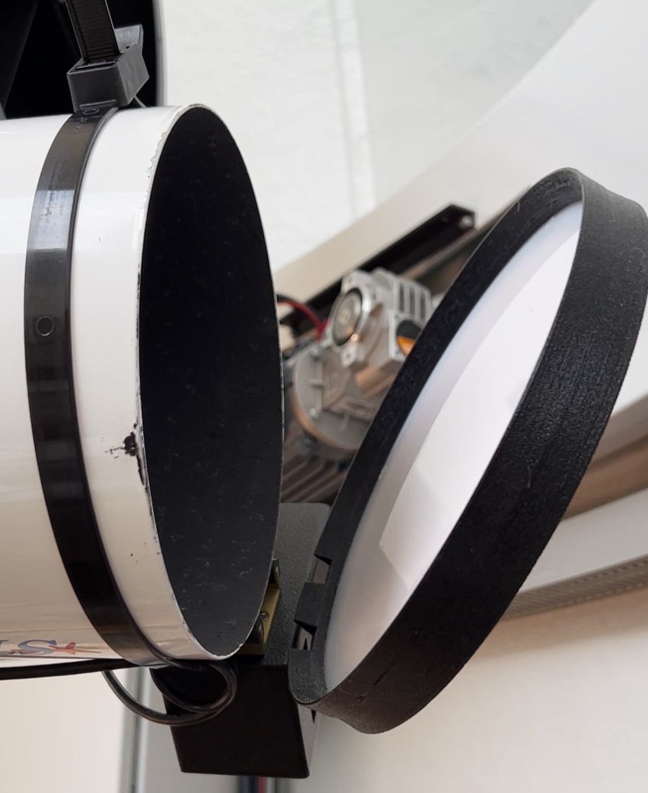
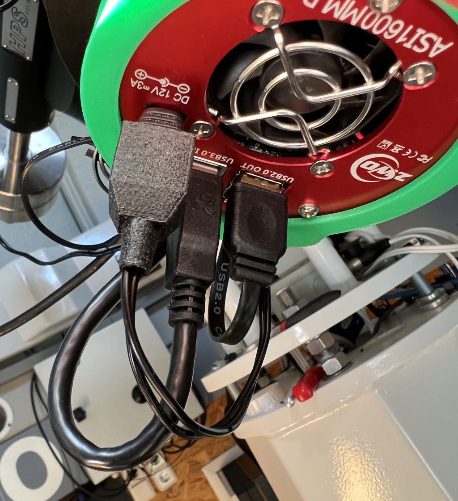

For months, I couldn't use my observatory as first the dome had trouble with its motor and after that worked again, the Mount computer suddenly died. So it had to be sent to the manufacturer for repair.
All these cirumstances resulted in the fact that even though I already bought my CDK in March 2021, even in May 2022 I still wasn't able to run even one single imaging night.
So I started to use the time to upgrade and improve my equipment, and change some old "interim" solutions, that would otherwise become final ones, eventually...

For quite some time I had two devices on my personal "wish list" and in May 2022 I finally decided to buy these items:
1. The Optec Alnitak Flip-Flat for use with the StarFire Refractor.
2. The PegausAstro Falcon Rotator for use with my Camera (and adapted using the Baader M68 System so I can mount it all on any Telescope).

### The Optec Alnitak Flip-Flat

To build a really remote-controllable Observatory, you need a solution to remotely open and close the cover of the telescopes. Some years ago, I tried to develop something myself - see my [Klodeckelautomat Repository](https://github.com/hdiessner/klodeckelautomat) and it worked pretty well, but only with a standalone PC application as I didn't want to do a deep-dive into ASCOM driver programming.

Enter Flip-Flat: Remote opening and closing of the telecope cover, but even combined with a flat fielding device integrated into the cover including ASCOM & INDI drivers. But could it also be used for creating dark frames while in closed position and the flat field light turned off?

At least, my version doesn't really light-seal the front when covering the Telescope - and if light can shine in, dust might enter aswell. So I needed to change that. As I bought the largest version with 190mm diameter, a 3d design of an additional sealing made from flex filament came to mind. It should just fit onto the print bed of my 3d printer. So I designed it and after some 8 hours of printing time I was able to test my new "Alnitak Skirt":
- fits perfectly around the cover part
- needed two small, additional cut-outs (sharp knife) to not interfere with the base of the motor box
- when closed, the cover is now light-tight and the inside of the scope is perfectly dark

[Zweiter Versuch](https://hdiessner.github.io/AstroHD/assets/images/FlipFlatSkirt.jpg)
[Vielleicht so](/AstroHD/assets/images/FlipFlatSkirt.jpg)
[Oder evtl so](/assets/images/FlipFlatSkirt.jpg)
[So wohl auch nicht](/hdiessner/AstroHD/assets/images/FlipFlatSkirt.jpg)

I uploaded the STL file over on [Thingiverse](https://www.thingiverse.com/thing:5391034)

### The PegasusAstro Falcon Rotator

Similar to a remote telescope cover, changing the rotation angle of the camera in a remote controlled observatory need a special solution. As the camera used in astro photography tends to be quite expensive and as sensor sizes are increasing, I didn't even dare to think about creating my own solution, especially as there are some already available in the market in different price ranges.

Easiest would have been to use the original Planewave rotating focuser but this is way out of my budget - I was happy I could afford the CDK 12.5 at all, event with the standard Hedrick focuser it is quite a pricetag. When comparing available products, load specs and free diameter of the opening, for me the Falcon was the sweet spot of price and performance.

I did some calculations to get the adapter combination right to be able to connect my camera to any of my telescopes.
- I want to use Rotator - Filter Wheel - Camera as ONE permanently assembled unit; they won't be disconnected from each other in regular use
- I need to replace the previously used CANON bayonet adapters by a combination of M68 adapters of the same optical length
- Of course, when assembled and installed on the telecope it also needs to look as clean as possible (e.g. aligned to other devices).

To achieve the perfect optical distance, I needed to add a few millimeters to the optical path. And to position the Rotator well aligned to the top of the telescope, I also needed to add a fraction of a millimeter: The threads of the M68 system travel 1mm per one round, I needed to turn the rotator by almost a third of a round which translated into 0.3mm. I quickly designed rings, printed from PLA (for optical and "coolness" reasons Carbon PLA actually), with an inner diameter of 68mm and different widths ranging from 0.5 to 2mm that I just put between two M68 adapter rings to add the necessary optical length. As the design is that simple, I didn't upload the rings to Thingiverse - designing them from scratch might be faster than searching for it online. ;-)

### Small improvement for Power Supply
When building my observatory, I took care of power distibution in the observatory and especially on the mount. So I have not only 240V mains current on the top of the mount but my own-designed 12V power distribution box. When I bought my cooled Astro camera, I didn't have the right 12V power plug so I quickly created an interim solution.
That was years ago! So time, to create a permanent power plug. I recently bought a bag of 1.2x5.5mm plugs with screw terminals for the two wires. But what I didn't like about that: These terminals still are open to the environmental forces. So I designed a small cap that I can run through the cable and that slips over the screw terminals. So special connectors the cap just stays over the terminals from the friction.
Even if this design is not really sphisticated, it does it's job and I put it on [Thingiverse](https://www.thingiverse.com/thing:5391057).

With that, the power plug for my camera looks much better than before!

